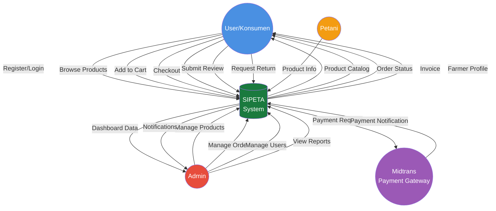
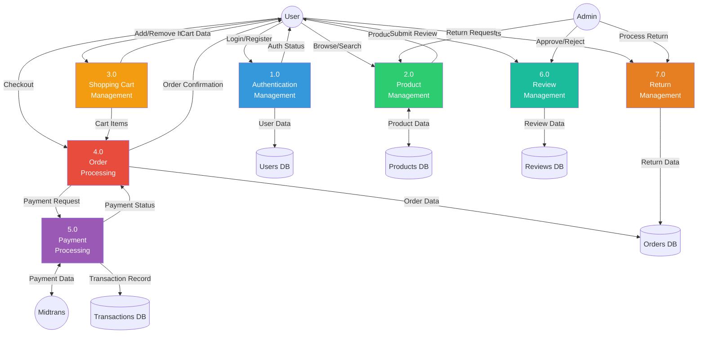
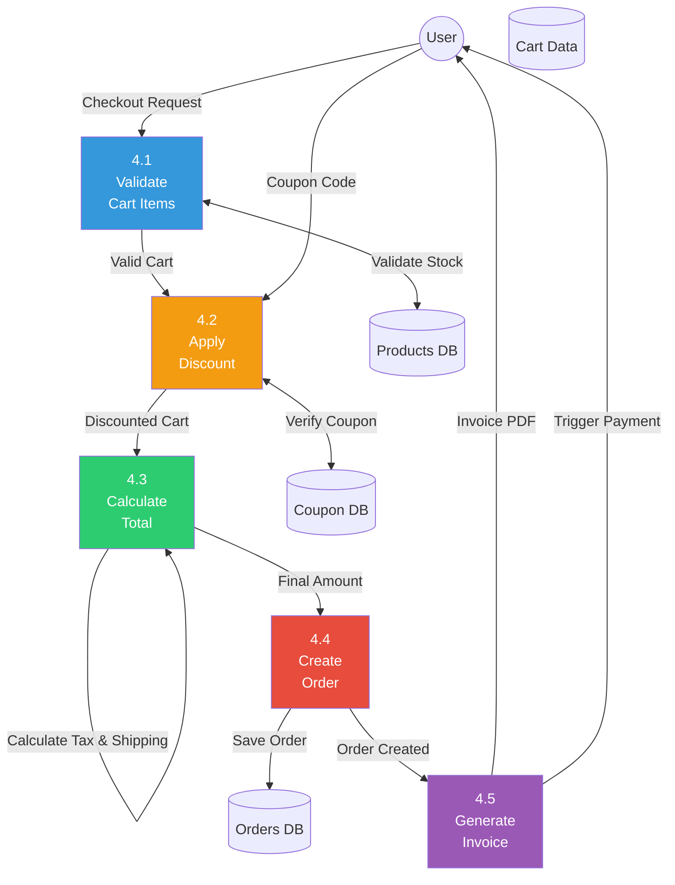
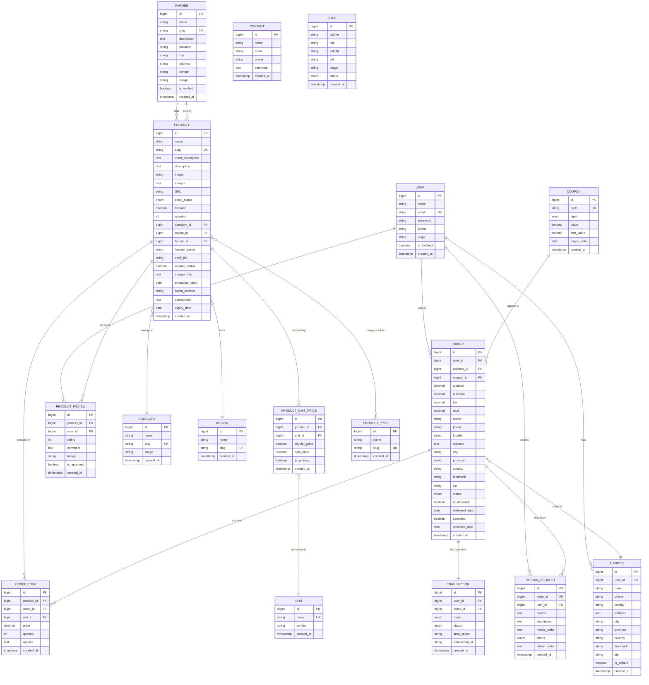

# PRESENTASI PROJECT SIPETA

## Sistem Informasi Penjualan Tanaman

---

## 📋 SLIDE 1: COVER

<div align="center">

# **SIPETA**

### Sistem Informasi Penjualan Tanaman

**Platform E-Commerce untuk Produk Pertanian Segar dan Berkualitas**

---

**Pencipta:**  
A'AN  
Program Studi Sistem Informasi

---

_2026_

</div>

---

## 📖 SLIDE 2: LATAR BELAKANG

### Permasalahan yang Diidentifikasi:

1. **Kesulitan Pemasaran Petani**
    - Petani lokal kesulitan memasarkan produk pertanian mereka secara langsung ke konsumen
    - Terjebak dalam rantai distribusi panjang yang mengurangi keuntungan mereka
    - Keterbatasan akses terhadap platform digital untuk menjual produk

2. **Tantangan Konsumen**
    - Konsumen sering kesulitan mendapatkan produk pertanian segar, berkualitas, dan organik langsung dari sumber terpercaya
    - Harga produk pertanian di pasar tradisional seringkali tidak transparan
    - Kurangnya informasi lengkap tentang asal-usul produk

3. **Minimnya Transparansi**
    - Ketidakjelasan dalam rantai pasokan produk pertanian
    - Keraguan konsumen terhadap keaslian dan kualitas produk organik
    - Tidak ada sistem tracking dari petani ke konsumen

4. **Kebutuhan Digitalisasi**
    - Dibutuhkan platform digital yang dapat menghubungkan petani dengan konsumen secara langsung
    - Meningkatkan transparansi dalam ekosistem pertanian
    - Mendukung pertanian berkelanjutan dan pemberdayaan petani lokal

### Solusi:

**SIPETA hadir sebagai solusi digital** yang menjembatani kesenjangan antara petani dan konsumen, memberikan:

- ✅ **Akses pasar lebih luas** bagi petani
- ✅ **Produk segar berkualitas** dengan harga transparan untuk konsumen
- ✅ **Transparansi penuh** dari kebun hingga meja makan
- ✅ **Pemberdayaan ekonomi** petani lokal Indonesia

---

---

## 🎯 SLIDE 3: TUJUAN

### Tujuan Pengembangan Sistem:

Platform ini dirancang untuk membuka akses pasar digital secara langsung bagi petani lokal, memangkas rantai distribusi, dan meningkatkan kesejahteraan mereka. Kami berkomitmen menyediakan kemudahan bagi masyarakat luas dalam mendapatkan produk pertanian yang segar, sehat, dan berkualitas dengan harga yang kompetitif.

Lebih jauh lagi, sistem SIPETA dibangun dengan fondasi transparansi untuk menciptakan ekosistem jual beli yang terpercaya melalui verifikasi profil penjual dan informasi produk yang jelas. Melalui inisiatif ini, diharapkan terjadi percepatan modernisasi di sektor pertanian Indonesia, sekaligus mendorong daya saing produk lokal di era ekonomi digital.

---

## 🚧 SLIDE 4: BATASAN MASALAH

### Ruang Lingkup & Batasan Sistem:

1.  **Lingkup Produk**
    - Sistem hanya melayani penjualan produk pertanian (sayur, buah, tanaman hias, pupuk, alat tani).
    - Tidak mencakup penjualan barang umum atau non-agrikultur.

2.  **Wilayah Operasional**
    - Fokus implementasi awal pada wilayah Indonesia.
    - Pengiriman terbatas pada area yang terjangkau oleh ekspedisi lokal.

3.  **Pengguna Sistem**
    - **Petani (Penjual):** Pihak yang menjual produk hasil tani.
    - **Konsumen (Pembeli):** Pengguna akhir yang membeli produk.
    - **Admin:** Pengelola sistem SIPETA.
    - _Tidak mencakup peran Reseller atau Dropshipper._

4.  **Platform Teknologi**
    - Berbasis Web (Web-based Application).
    - Dapat diakses melalui browser Desktop dan Mobile (Responsif), namun bukan aplikasi Native Mobile (Android/iOS).

5.  **Transaksi & Pembayaran**
    - Pembayaran melalui Payment Gateway (Midtrans).
    - Tidak menangani transaksi tunai (COD) secara langsung dalam sistem (kecuali fitur mendatang).

---

## 🌟 SLIDE 5: KELEBIHAN PROJECT

### Keunggulan Kompetitif SIPETA:

1.  **Transparansi & Traceability**
    - Konsumen dapat mengetahui asal-usul produk dan profil petani secara detail, membangun kepercayaan yang lebih kuat dibandingkan pasar konvensional.

2.  **Fleksibilitas Pembayaran (Midtrans)**
    - Mendukung berbagai metode pembayaran otomatis (Virtual Account, E-Wallet, QRIS) yang memudahkan transaksi bagi pengguna milenial maupun umum.

3.  **Dashboard Admin yang Dinamis & Informatif**
    - Dilengkapi dengan analitik visual (ApexCharts) untuk memantau performa penjualan, stok, dan pendaftaran petani secara real-time.

4.  **Sistem Multi-Harga (Multi-Unit Pricing)**
    - Fleksibilitas unik yang memungkinkan petani menjual produk dalam berbagai satuan (per kg, per ikat, per box) dalam satu halaman produk.

5.  **Pengalaman Pengguna (UX) Modern**
    - Antarmuka responsif yang cepat (Vite + Tailwind/Bootstrap) dengan fitur interaktif seperti Live Search, Wishlist, dan Tracking Order Real-time.

---

## 🛠️ SLIDE 6: TOOLS & TEKNOLOGI

### 💻 Teknologi & Tools Utama

| Kategori      | Stack yang Digunakan                                                                |
| :------------ | :---------------------------------------------------------------------------------- |
| **Backend**   | **Laravel 12** (PHP 8.2), **MySQL**                                                 |
| **Frontend**  | **Blade**, **Bootstrap 5**, **TailwindCSS 4**, **SCSS**, **Vite**, **jQuery**       |
| **Libraries** | **Swiper.js**, **SweetAlert2**, **ApexCharts**, **Fancybox**, **Axios**, **DomPDF** |
| **Integrasi** | **Midtrans** (Payment), **Cloudinary** (Images), **Google OAuth**, **Socialite**    |
| **Dev Tools** | **Laragon**, **Git**, **Composer**, **NPM**, **VS Code**, **Postman**, **Draw.io**  |

---

## 👥 SLIDE 7: USE CASE DIAGRAM

### Use Case Diagram - SIPETA System

```mermaid
graph TB
    subgraph "SIPETA System"
        %% Guest Features
        UC_Browse[Browse Products]
        UC_Search[Search Products]
        UC_ViewDetail[View Product Detail]
        UC_Register[Register]
        UC_ViewFarmer[View Farmer Profile]

        %% Customer Features
        UC_Login[Login]
        UC_Logout[Logout]
        UC_ManageProfile[Update Profile]
        UC_Cart[Add to Cart & Manage Cart]
        UC_Checkout[Checkout]
        UC_Payment[Make Payment]
        UC_Track[Track Order]
        UC_Review[Submit Review]
        UC_Return[Request Return]
        UC_History[View Order History]
        UC_Wishlist[Manage Wishlist]
        UC_Invoice[Download Invoice]

        %% Admin Features
        UC_ProdManage[Manage Products]
        UC_CatManage[Manage Categories]
        UC_FarmerManage[Manage Farmers]
        UC_OrderManage[Manage Orders]
        UC_ReturnManage[Manage Returns]
        UC_UserManage[Manage Users]
        UC_Report[View Reports & Analytics]
        UC_Coupon[Manage Coupons]
        UC_Slide[Manage Slides/Banners]
        UC_Contact[Manage Inquiries]
    end

    Guest((Guest))
    Customer((Customer))
    Admin((Admin))
    PaymentGateway{{Payment Gateway<br/>(Midtrans)}}

    %% Guest Relationships
    Guest --> UC_Browse
    Guest --> UC_Search
    Guest --> UC_ViewDetail
    Guest --> UC_Register
    Guest --> UC_ViewFarmer

    %% Customer Relationships (Inherits Guest)
    Customer -.-|> Guest
    Customer --> UC_Login
    Customer --> UC_Logout
    Customer --> UC_ManageProfile
    Customer --> UC_Cart
    Customer --> UC_Checkout
    Customer --> UC_Payment
    Customer --> UC_Track
    Customer --> UC_Review
    Customer --> UC_Return
    Customer --> UC_History
    Customer --> UC_Wishlist
    Customer --> UC_Invoice

    %% Admin Relationships
    Admin --> UC_ProdManage
    Admin --> UC_CatManage
    Admin --> UC_FarmerManage
    Admin --> UC_OrderManage
    Admin --> UC_ReturnManage
    Admin --> UC_UserManage
    Admin --> UC_Report
    Admin --> UC_Coupon
    Admin --> UC_Slide
    Admin --> UC_Contact

    %% External Systems
    UC_Checkout -.include.-> UC_Payment
    UC_Payment -- Process Payment --> PaymentGateway

    style Guest fill:#95a5a6,color:#fff
    style Customer fill:#4a90e2,color:#fff
    style Admin fill:#e74c3c,color:#fff
    style PaymentGateway fill:#9b59b6,color:#fff
```

### Deskripsi Aktor & Use Case:

#### 1. 👤 Guest (Pengunjung)

Pengguna yang belum login. Memiliki akses terbatas untuk eksplorasi sistem:

- **Browse & Search**: Mencari produk dan melihat detail.
- **View Farmer**: Melihat profil petani penjual.
- **Register**: Mendaftar menjadi Customer.

#### 2. 🛍️ Customer (Pelanggan)

Pengguna terdaftar. Memiliki akses penuh fitur belanja (**Inherits Guest**):

- **Shopping**: Manage Cart, Checkout, Wishlist.
- **Transaction**: Melakukan pembayaran dan melacak pesanan.
- **Account**: Update profil, riwayat pesanan, retur, dan review.

#### 3. 👨‍💼 Admin (Pengelola)

Memiliki hak akses penuh untuk manajemen operasional sistem:

- **Master Data**: Produk, Kategori, User, Petani.
- **Transaksi**: Proses pesanan, retur, dan laporan keuangan.
- **Konten**: Banner, Promo/Kupon.

#### 4. 💳 Payment Gateway (Sistem Eksternal)

Aktor sistem eksternal (Midtrans) yang bertugas memproses pembayaran aman dari Customer.

---

## 🔄 SLIDE 8: DATA FLOW DIAGRAM (DFD)

### DFD Level 0 (Context Diagram)



### DFD Level 1 (Main Processes)



### DFD Level 2 - Order Processing (Detail Proses 4.0)



---

## 🗄️ SLIDE 9: ENTITY RELATIONSHIP DIAGRAM (ERD)

### Database Schema SIPETA



### Penjelasan Relasi Utama:

1. **User → Order (1:N)**: Satu user dapat memiliki banyak pesanan
2. **Order → OrderItem (1:N)**: Satu pesanan berisi banyak item produk
3. **Product → OrderItem (1:N)**: Satu produk dapat dipesan berkali-kali
4. **Farmer → Product (1:N)**: Satu petani dapat menjual banyak produk
5. **Product → Category (N:1)**: Banyak produk dalam satu kategori
6. **Product → ProductUnitPrice (1:N)**: Satu produk memiliki banyak pilihan satuan harga
7. **Product → ProductType (N:M)**: Produk dapat memiliki banyak tipe (organik, lokal, dll)
8. **Order → Transaction (1:1)**: Setiap pesanan memiliki satu transaksi pembayaran
9. **User → Address (1:N)**: Satu user dapat memiliki banyak alamat pengiriman
10. **Order → ReturnRequest (1:N)**: Satu pesanan dapat memiliki permintaan retur
